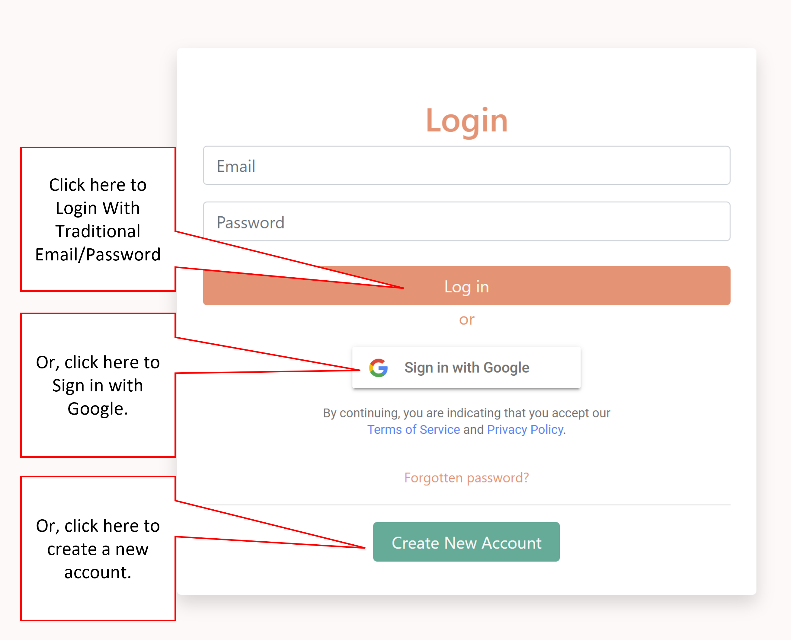

# :wave: is216-project

  

## 🤓 IS216 - Group 31 - PetSociety

## Purpose is to allow heroku to host this repo

<ol>

<li>Caleb Cheong | calebcheong.2020@scis.smu.edu.sg</li>

<li>Lew Yong Jiun | yjlew.2020@scis.smu.edu.sg</li>

<li>Ching Rou</li>

<li>Gerald</li>

<li>Lin Shuyi (Rinelle) | shuyi.lin.2020@scis.smu.edu.sg</li>

</ol>

  

## 🤓 Project Overview ##

Pet Society, is a platform that centers around animal profiling. Data collected enables the feature to track stray animal’s locations, health status and feeding schedules. Focus functions such as “Posts-with-Tags”, “Live-Chat” and “Location services for last seen whereabouts” allows users to share and receive up-to-date information about the stray animals of interest better. We believe these functionalities will aid the community in the process of stray animal management and the identified social missions. The application is also inclusive to those who just want to create an account for their pets or follow other pets online.

  

All in all, our application aims to create greater public awareness and support for Singapore’s strays through the sharing of personal experiences and interaction with stray animals among the community.

  

## Why not create a channel on an existing social media platform ##

Social media platforms like Facebook, have a large community of people who look out and care for stray animals, however there are many of such communities with the same purpose which dilutes the effectiveness of it as they are not linked to each other. Users are dispersed across communities and thus the unfulfilled potential of collection and dissemination of information. Also, existing social media platforms lack specific features that would assist users in their effort to cater to these stray animals.

  

## 🤓 How to Use Our Web Application (for Visitors to our Website) ##

Our website is accessible on the internet here: https://is216wadgroup31.vercel.app
Please allow location when requested to ensure your best experience with Pet Society.

If you see a warning message like in the picture below and have already turned on your location services, please refresh the browser.

  

**How to Use**

***Create an account***

* Register here: https://is216wadgroup31.vercel.app/screens/registration.html
* Or Sign In with Google, which will automatically create a Pet Society account for you

***Log Into your account***

* Log In here: https://is216wadgroup31.vercel.app/screens/login.html
* Or Sign In with Google

***Find Friends***

You can find your friend by searching their user name in the Navigation Bar

***Find Pets***

You can find near by pets on the 'Nearby Pets' bar on the homepage. Make sure you allow location as the app will display pets in close proximity to you

***Chat With Friends***

You can chat with friends on the homepage or at the dedicated chat screen. You can find the link to the dedicated chat screen on the navigation bar

***View Posts***

You are able to view posts on your homepage, profile page or pet's profile page. Your homepage will only display post of users that your are following or pets that you are following

***Create Posts***

You can create posts with/without picture on the 'New Post' button located at the navigation bar.

You can tag a pet while creating the post. This will update the pet's last seen location and also post on the pet's profile page. Where other users who follow the tagged pet can see your post.

***Can't your neighbourhood pet?***

If you are not able to find your neighbourhood pet in the nearby pets' list. This could mean that no one has catalogged the pet before. This is a chance for you to be the 'owner' of the pet profile on Pet Society. Click "Add Pet" on the "Nearby Pets" menu and follow the instructions to create a pet profile for the pet and for other users on the platform to find and take care of the pet.

***Visiting A Pet***

You are able find the location of the pet by going to it's pet profile. Where you can find the address of the pet's last seen and a interactive google map that can direct you to the pet. 

***Feeding Pets***

To ensure the pets are well fed and also not over fed. Please check if the pet has already been fed from it's profile page. If you are feeding the pet, Please take a picture of the pet with your food to autheticate the process 

  
  

## 🤓 List of APIs Used ##

1. Google Firebase API ([https://firebase.google.com/docs/reference](https://firebase.google.com/docs/reference))
2. Google Maps API ([https://developers.google.com/maps](https://developers.google.com/maps))
3. Here Location API ([https://www.here.com/](https://www.here.com/))
4. Geolocation API([https://developer.mozilla.org/en-US/docand](https://developer.mozilla.org/en-US/docand) i s/Web/API/Geolocation_API)
5. TheCat API: To get breeds of cats ([https://thecatapi.com/](https://thecatapi.com/))
6. TheDog API: To get breeds of dog ([https://www.thedogapi.com/](https://www.thedogapi.com/))